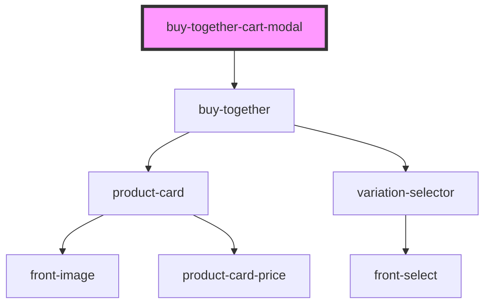

# buy-together-cart-modal

<!-- Auto Generated Below -->

## Properties

| Property         | Attribute         | Description | Type     | Default     |
| ---------------- | ----------------- | ----------- | -------- | ----------- |
| `buyButtonText`  | `buy-button-text` |             | `string` | `undefined` |
| `containerTitle` | `container-title` |             | `string` | `undefined` |
| `productId`      | `product-id`      |             | `number` | `undefined` |
| `promotionTitle` | `promotion-title` |             | `string` | `undefined` |
| `variationId`    | `variation-id`    |             | `number` | `undefined` |

## Events

| Event                    | Description | Type                |
| ------------------------ | ----------- | ------------------- |
| `componentRendered`      |             | `CustomEvent<void>` |
| `on-continue-buy-button` |             | `CustomEvent<void>` |
| `on-finish-buy-button`   |             | `CustomEvent<void>` |

## Dependencies

### Depends on

- [buy-together](../buy-together)

### Graph

----------------------------------------------

*Built with [StencilJS](https://stenciljs.com/)*
