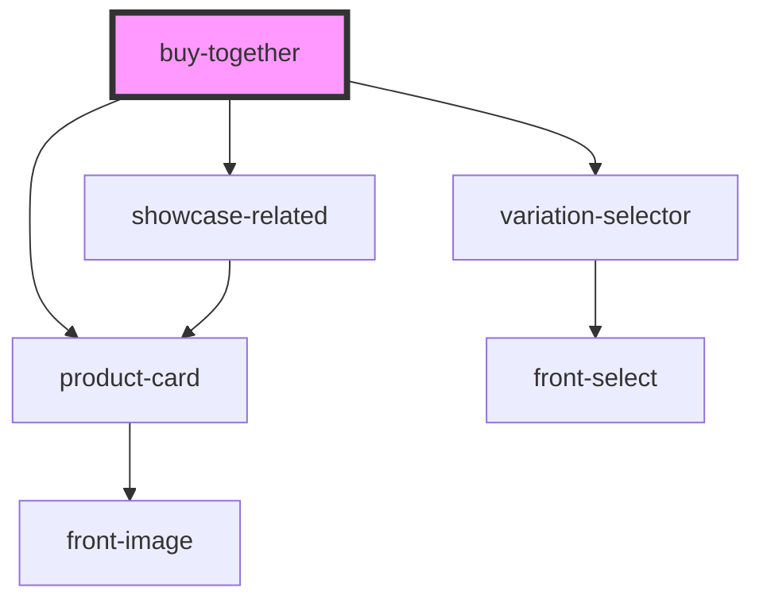

# buy-together

<!-- Auto Generated Below -->

## Properties

| Property             | Attribute              | Description | Type      | Default     |
| -------------------- | ---------------------- | ----------- | --------- | ----------- |
| `productId`          | `product-id`           |             | `number`  | `undefined` |
| `showcaseMode`       | `showcase-mode`        |             | `boolean` | `undefined` |
| `simpleShowcaseMode` | `simple-showcase-mode` |             | `boolean` | `undefined` |
| `variationId`        | `variation-id`         |             | `number`  | `undefined` |

## Events

| Event                      | Description | Type                                                                                     |
| -------------------------- | ----------- | ---------------------------------------------------------------------------------------- |
| `loadBuyTogehter`          |             | `CustomEvent<{ status: EnumBuyTogetherOnLoadStatus; data: IBuyTogetherComponentData; }>` |
| `on-buy-together-add-cart` |             | `CustomEvent<IProductCard[]>`                                                            |

## Methods

### `getBuyTogetherData() => Promise<IBuyTogetherComponentData>`

#### Returns

Type: `Promise<IBuyTogetherComponentData>`

## Dependencies

### Depends on

- [product-card](../ui/product-card)
- [variation-selector](../ui/variation-selector)
- [showcase-related](../showcase)

### Graph

----------------------------------------------

*Built with [StencilJS](https://stenciljs.com/)*
