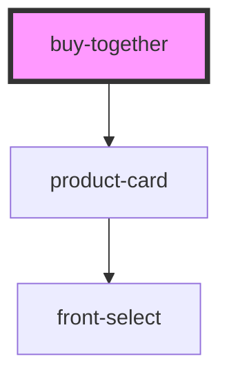

# buy-together

<!-- Auto Generated Below -->

## Properties

| Property    | Attribute    | Description | Type     | Default     |
| ----------- | ------------ | ----------- | -------- | ----------- |
| `productId` | `product-id` |             | `number` | `undefined` |

## Dependencies

### Depends on

- [product-card](../ui/product-card)

### Graph

----------------------------------------------

*Built with [StencilJS](https://stenciljs.com/)*
