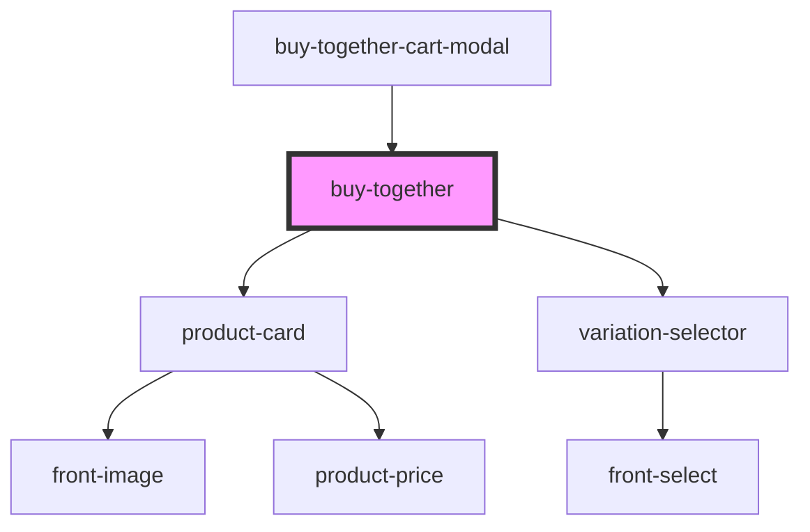

# buy-together

<!-- Auto Generated Below -->

## Properties

| Property         | Attribute         | Description | Type      | Default     |
| ---------------- | ----------------- | ----------- | --------- | ----------- |
| `buyButtonText`  | `buy-button-text` |             | `string`  | `undefined` |
| `productId`      | `product-id`      |             | `number`  | `undefined` |
| `promotionTitle` | `promotion-title` |             | `string`  | `undefined` |
| `showcaseMode`   | `showcase-mode`   |             | `boolean` | `undefined` |
| `variationId`    | `variation-id`    |             | `number`  | `undefined` |

## Events

| Event                      | Description | Type                                                                                     |
| -------------------------- | ----------- | ---------------------------------------------------------------------------------------- |
| `loadBuyTogehter`          |             | `CustomEvent<{ status: EnumBuyTogetherOnLoadStatus; data: IBuyTogetherComponentData; }>` |
| `on-buy-together-add-cart` |             | `CustomEvent<{ showcaseMode: boolean; productsAdded: IProductCard[]; }>`                 |

## Methods

### `getBuyTogetherData() => Promise<IBuyTogetherComponentData>`

#### Returns

Type: `Promise<IBuyTogetherComponentData>`

## Dependencies

### Used by

 - [buy-together-cart-modal](../buy-together-cart-modal)

### Depends on

- [product-card](../ui/product-card)
- [variation-selector](../ui/variation-selector)

### Graph

----------------------------------------------

*Built with [StencilJS](https://stenciljs.com/)*
