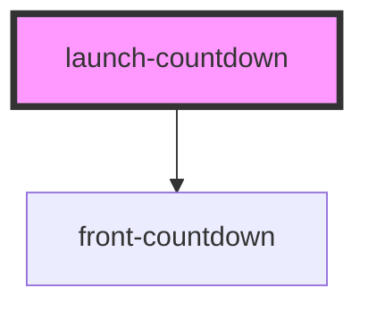

# launch-countdown

<!-- Auto Generated Below -->

## Properties

| Property             | Attribute              | Description | Type     | Default                                                     |
| -------------------- | ---------------------- | ----------- | -------- | ----------------------------------------------------------- |
| `dataCountdownTitle` | `data-countdown-title` |             | `string` | `'Agora falta muito pouco!'`                                |
| `dataDescription`    | `data-description`     |             | `string` | `'O produto que você tanto espera será liberado em breve.'` |
| `dataInitialDate`    | `data-initial-date`    |             | `string` | `undefined`                                                 |
| `dataTargetDate`     | `data-target-date`     |             | `string` | `undefined`                                                 |
| `productId`          | `product-id`           |             | `string` | `undefined`                                                 |
| `variationId`        | `variation-id`         |             | `string` | `undefined`                                                 |

## Events

| Event             | Description | Type                                           |
| ----------------- | ----------- | ---------------------------------------------- |
| `countdownLoaded` |             | `CustomEvent<{ releaseDateActive: boolean; }>` |

## Dependencies

### Depends on

- [front-countdown](../ui/front-countdown)

### Graph

----------------------------------------------

*Built with [StencilJS](https://stenciljs.com/)*
