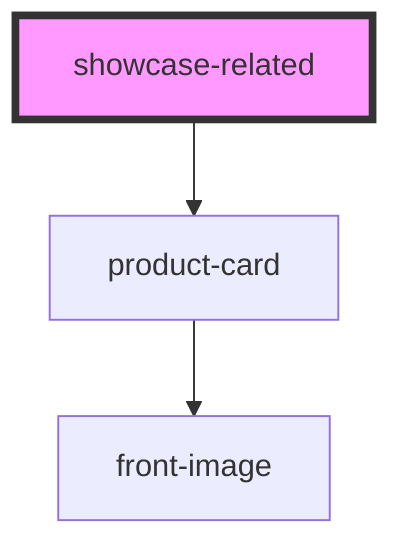

# showcase-teste

<!-- Auto Generated Below -->

## Properties

| Property                | Attribute                  | Description | Type     | Default     |
| ----------------------- | -------------------------- | ----------- | -------- | ----------- |
| `buyTogetherProductIds` | `buy-together-product-ids` |             | `string` | `undefined` |
| `productsPerPage`       | `products-per-page`        |             | `number` | `3`         |

## Events

| Event            | Description | Type               |
| ---------------- | ----------- | ------------------ |
| `clickBuyButton` |             | `CustomEvent<any>` |

## Methods

### `load() => Promise<void>`

#### Returns

Type: `Promise<void>`

## Dependencies

### Depends on

- [product-card](../ui/product-card)

### Graph

----------------------------------------------

*Built with [StencilJS](https://stenciljs.com/)*
