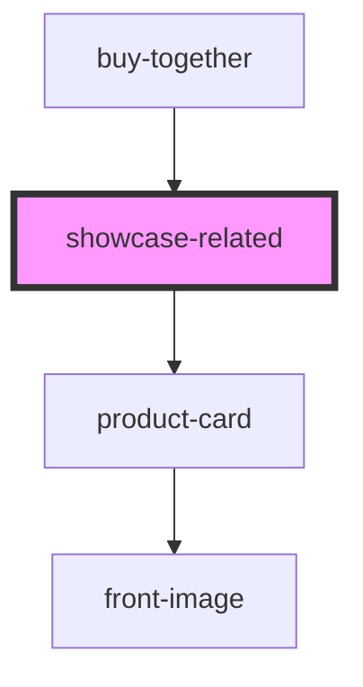

# showcase-teste

<!-- Auto Generated Below -->

## Properties

| Property          | Attribute           | Description | Type             | Default     |
| ----------------- | ------------------- | ----------- | ---------------- | ----------- |
| `products`        | --                  |             | `IProductCard[]` | `undefined` |
| `productsPerPage` | `products-per-page` |             | `number`         | `3`         |

## Events

| Event            | Description | Type               |
| ---------------- | ----------- | ------------------ |
| `clickBuyButton` |             | `CustomEvent<any>` |

## Methods

### `onClickBuyButtonEmit(event: any, product: IProductCard) => Promise<void>`

#### Parameters

| Name      | Type           | Description |
| --------- | -------------- | ----------- |
| `event`   | `any`          |             |
| `product` | `IProductCard` |             |

#### Returns

Type: `Promise<void>`

## Dependencies

### Used by

 - [buy-together](../buy-together)

### Depends on

- [product-card](../ui/product-card)

### Graph

----------------------------------------------

*Built with [StencilJS](https://stenciljs.com/)*
