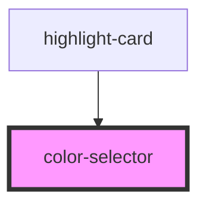

# color-selector

<!-- Auto Generated Below -->

## Properties

| Property     | Attribute     | Description | Type       | Default     |
| ------------ | ------------- | ----------- | ---------- | ----------- |
| `colors`     | --            |             | `IColor[]` | `[]`        |
| `selectedId` | `selected-id` |             | `number`   | `undefined` |

## Events

| Event           | Description | Type                  |
| --------------- | ----------- | --------------------- |
| `colorSelected` |             | `CustomEvent<IColor>` |

## Dependencies

### Used by

 - [highlight-card](../highlight-card)

### Graph

----------------------------------------------

*Built with [StencilJS](https://stenciljs.com/)*
