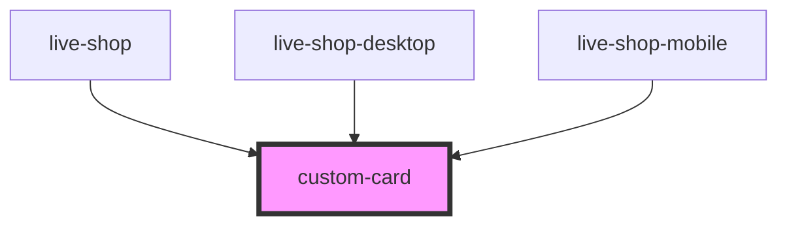

# custom-card

<!-- Auto Generated Below -->

## Properties

| Property          | Attribute          | Description | Type     | Default                               |
| ----------------- | ------------------ | ----------- | -------- | ------------------------------------- |
| `cardDescription` | `card-description` |             | `string` | `undefined`                           |
| `cardTitle`       | `card-title`       |             | `string` | `'Não perca! Live hoje às 19 horas.'` |
| `customClass`     | `custom-class`     |             | `string` | `''`                                  |

## Events

| Event               | Description | Type                |
| ------------------- | ----------- | ------------------- |
| `componentRendered` |             | `CustomEvent<void>` |

## Dependencies

### Used by

 - [live-shop](../../live-shop)
 - [live-shop-desktop](../../live-shop/snippets)
 - [live-shop-mobile](../../live-shop/snippets)

### Graph

----------------------------------------------

*Built with [StencilJS](https://stenciljs.com/)*
