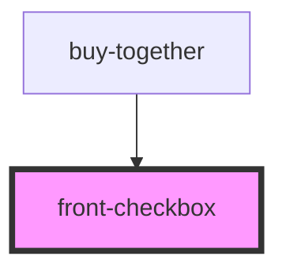

# front-checkbox

<!-- Auto Generated Below -->

## Properties

| Property    | Attribute    | Description | Type      | Default     |
| ----------- | ------------ | ----------- | --------- | ----------- |
| `checked`   | `checked`    |             | `boolean` | `undefined` |
| `disabled`  | `disabled`   |             | `boolean` | `undefined` |
| `inputId`   | `input-id`   |             | `string`  | `undefined` |
| `inputName` | `input-name` |             | `string`  | `undefined` |

## Dependencies

### Used by

 - [buy-together](../../buy-together)

### Graph

----------------------------------------------

*Built with [StencilJS](https://stenciljs.com/)*
