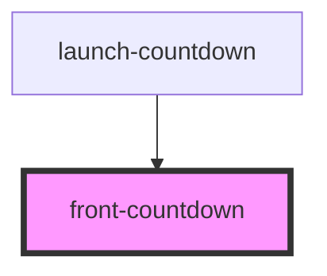

# front-countdown

<!-- Auto Generated Below -->

## Properties

| Property    | Attribute    | Description | Type     | Default     |
| ----------- | ------------ | ----------- | -------- | ----------- |
| `endDate`   | `end-date`   |             | `string` | `undefined` |
| `startDate` | `start-date` |             | `string` | `undefined` |

## Events

| Event               | Description | Type               |
| ------------------- | ----------- | ------------------ |
| `countdownFinished` |             | `CustomEvent<any>` |

## Dependencies

### Used by

 - [launch-countdown](../../launch-countdown)

### Graph

----------------------------------------------

*Built with [StencilJS](https://stenciljs.com/)*
