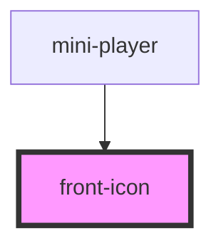

# front-icon

<!-- Auto Generated Below -->

## Properties

| Property | Attribute | Description | Type     | Default  |
| -------- | --------- | ----------- | -------- | -------- |
| `color`  | `color`   |             | `string` | `'#000'` |
| `name`   | `name`    |             | `string` | `'home'` |
| `size`   | `size`    |             | `string` | `'24px'` |

## Dependencies

### Used by

 - [mini-player](../mini-player)

### Graph

----------------------------------------------

*Built with [StencilJS](https://stenciljs.com/)*
