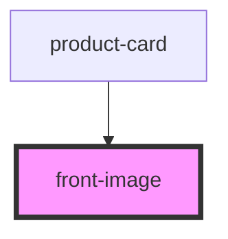

# front-image

<!-- Auto Generated Below -->

## Properties

| Property     | Attribute     | Description | Type     | Default     |
| ------------ | ------------- | ----------- | -------- | ----------- |
| `figCaption` | `fig-caption` |             | `string` | `undefined` |
| `imageSrc`   | `image-src`   |             | `string` | `undefined` |
| `textAlt`    | `text-alt`    |             | `string` | `undefined` |

## Dependencies

### Used by

 - [product-card](../product-card)

### Graph

----------------------------------------------

*Built with [StencilJS](https://stenciljs.com/)*
