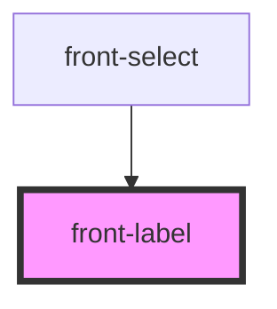

# front-label

<!-- Auto Generated Below -->

## Properties

| Property     | Attribute     | Description | Type     | Default     |
| ------------ | ------------- | ----------- | -------- | ----------- |
| `elementFor` | `element-for` |             | `string` | `undefined` |
| `label`      | `label`       |             | `string` | `undefined` |

## Dependencies

### Used by

 - [front-select](../front-select)

### Graph

----------------------------------------------

*Built with [StencilJS](https://stenciljs.com/)*
