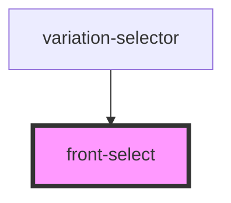

# front-select

<!-- Auto Generated Below -->

## Properties

| Property      | Attribute     | Description | Type                   | Default                                   |
| ------------- | ------------- | ----------- | ---------------------- | ----------------------------------------- |
| `label`       | `label`       |             | `string`               | `undefined`                               |
| `optionsList` | --            |             | `IFrontSelectOption[]` | `undefined`                               |
| `placeholder` | --            |             | `IFrontSelectOption`   | `{ name: 'Selecione', value: undefined }` |
| `selectId`    | `select-id`   |             | `string`               | `''`                                      |
| `selectName`  | `select-name` |             | `string`               | `''`                                      |
| `value`       | `value`       |             | `any`                  | `undefined`                               |

## Dependencies

### Used by

 - [variation-selector](../variation-selector)

### Graph

----------------------------------------------

*Built with [StencilJS](https://stenciljs.com/)*
