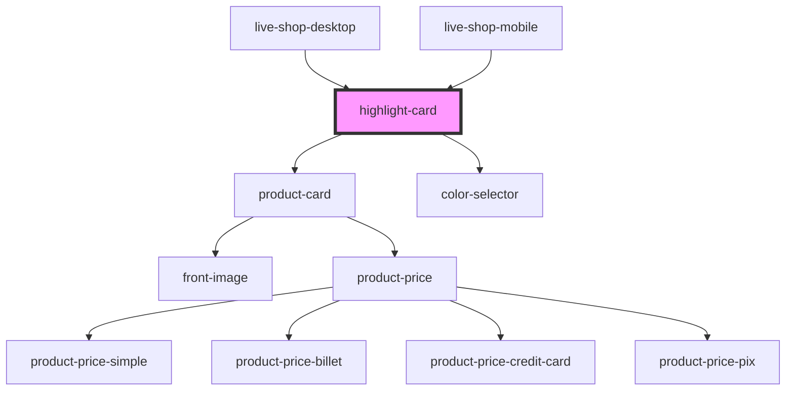

# highlight-card

<!-- Auto Generated Below -->

## Properties

| Property | Attribute | Description | Type                   | Default |
| -------- | --------- | ----------- | ---------------------- | ------- |
| `items`  | --        |             | `IHighlightCardItem[]` | `[]`    |

## Events

| Event               | Description | Type                                        |
| ------------------- | ----------- | ------------------------------------------- |
| `addItem`           |             | `CustomEvent<IMessageItem \| IProductItem>` |
| `componentRendered` |             | `CustomEvent<void>`                         |

## Dependencies

### Used by

 - [live-shop-desktop](../../live-shop/snippets)
 - [live-shop-mobile](../../live-shop/snippets)

### Depends on

- [product-card](../product-card)
- [color-selector](../color-selector)

### Graph

----------------------------------------------

*Built with [StencilJS](https://stenciljs.com/)*
