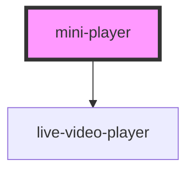

# mini-player

<!-- Auto Generated Below -->

## Properties

| Property     | Attribute     | Description | Type      | Default               |
| ------------ | ------------- | ----------- | --------- | --------------------- |
| `autoPlay`   | `auto-play`   |             | `boolean` | `false`               |
| `buttonText` | `button-text` |             | `string`  | `'Return'`            |
| `mainTitle`  | `main-title`  |             | `string`  | `'Mini Player Title'` |
| `videoId`    | `video-id`    |             | `string`  | `undefined`           |

## Events

| Event               | Description | Type                |
| ------------------- | ----------- | ------------------- |
| `componentRendered` |             | `CustomEvent<void>` |
| `on-click-button`   |             | `CustomEvent<void>` |

## Dependencies

### Depends on

- [live-video-player](../live-video-player)

### Graph

----------------------------------------------

*Built with [StencilJS](https://stenciljs.com/)*
