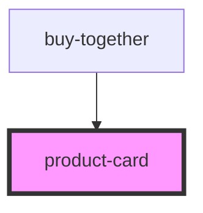

# product-card

<!-- Auto Generated Below -->

## Properties

| Property  | Attribute | Description | Type           | Default     |
| --------- | --------- | ----------- | -------------- | ----------- |
| `inline`  | `inline`  |             | `boolean`      | `false`     |
| `product` | --        |             | `IProductCard` | `undefined` |

## Dependencies

### Used by

 - [buy-together](../../buy-together)

### Graph

----------------------------------------------

*Built with [StencilJS](https://stenciljs.com/)*
