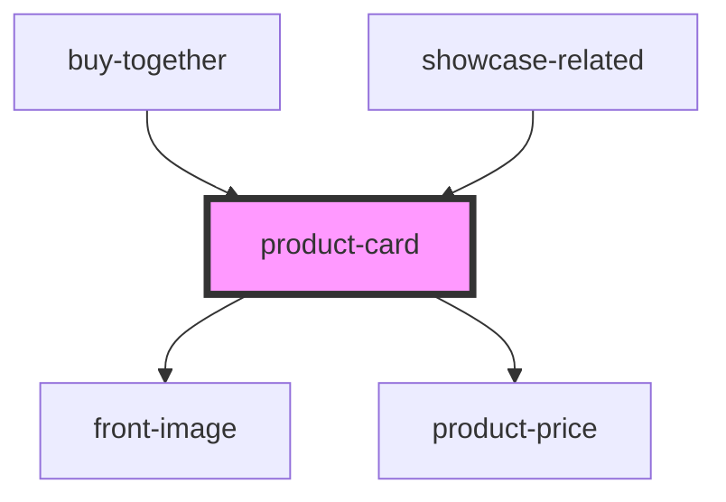

# product-card

<!-- Auto Generated Below -->

## Properties

| Property          | Attribute           | Description | Type           | Default     |
| ----------------- | ------------------- | ----------- | -------------- | ----------- |
| `inline`          | `inline`            |             | `boolean`      | `false`     |
| `product`         | --                  |             | `IProductCard` | `undefined` |
| `showSimplePrice` | `show-simple-price` |             | `boolean`      | `true`      |

## Dependencies

### Used by

 - [buy-together](../../buy-together)
 - [showcase-related](../../showcase)

### Depends on

- [front-image](../front-image)
- [product-price](../product-price)

### Graph

----------------------------------------------

*Built with [StencilJS](https://stenciljs.com/)*
