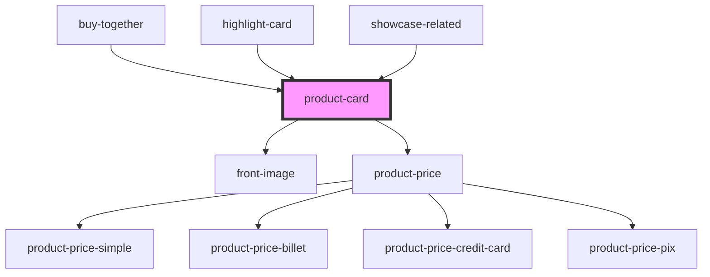

# product-card

<!-- Auto Generated Below -->

## Properties

| Property         | Attribute      | Description | Type              | Default     |
| ---------------- | -------------- | ----------- | ----------------- | ----------- |
| `basePrice`      | --             |             | `BasePrice`       | `undefined` |
| `customClass`    | `custom-class` |             | `string`          | `''`        |
| `inline`         | `inline`       |             | `boolean`         | `false`     |
| `paymentOptions` | --             |             | `PaymentOption[]` | `[]`        |
| `product`        | --             |             | `IProductCard`    | `undefined` |

## Dependencies

### Used by

 - [buy-together](../../buy-together)
 - [highlight-card](../highlight-card)
 - [showcase-related](../../showcase)

### Depends on

- [front-image](../front-image)
- [product-price](../product-price)

### Graph

----------------------------------------------

*Built with [StencilJS](https://stenciljs.com/)*
