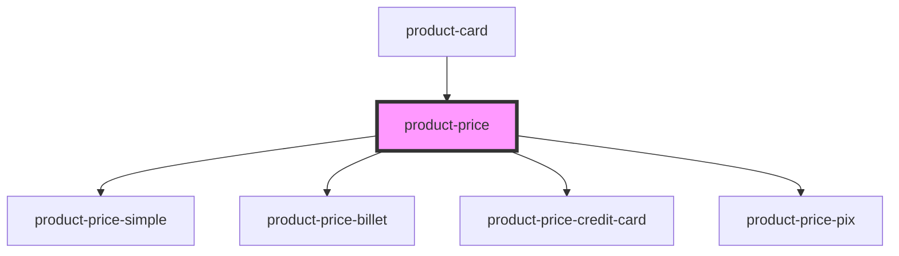

# product-price

<!-- Auto Generated Below -->

## Properties

| Property         | Attribute | Description | Type              | Default     |
| ---------------- | --------- | ----------- | ----------------- | ----------- |
| `basePrice`      | --        |             | `BasePrice`       | `undefined` |
| `paymentOptions` | --        |             | `PaymentOption[]` | `undefined` |

## Dependencies

### Used by

 - [product-card](../product-card)

### Depends on

- [product-price-simple](./snippets/simple)
- [product-price-billet](./snippets/billet)
- [product-price-credit-card](./snippets/credit-card)
- [product-price-pix](./snippets/pix)

### Graph

----------------------------------------------

*Built with [StencilJS](https://stenciljs.com/)*
