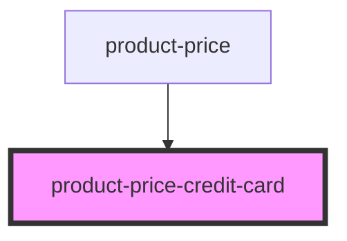

# product-price-credit-card

<!-- Auto Generated Below -->

## Properties

| Property       | Attribute       | Description | Type      | Default     |
| -------------- | --------------- | ----------- | --------- | ----------- |
| `hasInterest`  | `has-interest`  |             | `boolean` | `undefined` |
| `parcelPrice`  | `parcel-price`  |             | `number`  | `undefined` |
| `parcels`      | `parcels`       |             | `number`  | `undefined` |
| `price`        | `price`         |             | `number`  | `undefined` |
| `priceCompare` | `price-compare` |             | `number`  | `undefined` |

## Dependencies

### Used by

 - [product-price](../..)

### Graph

----------------------------------------------

*Built with [StencilJS](https://stenciljs.com/)*
