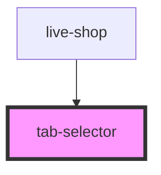

# generic-tabs

<!-- Auto Generated Below -->

## Properties

| Property | Attribute | Description | Type                                                  | Default     |
| -------- | --------- | ----------- | ----------------------------------------------------- | ----------- |
| `tabs`   | --        |             | `{ name: string; label: any; content: () => any; }[]` | `undefined` |

## Dependencies

### Used by

 - [live-shop](../../live-shop)

### Graph

----------------------------------------------

*Built with [StencilJS](https://stenciljs.com/)*
