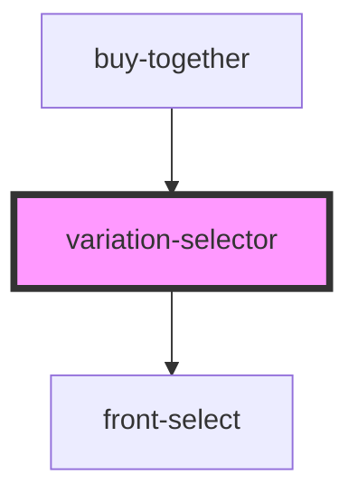

# variation-selector

<!-- Auto Generated Below -->

## Properties

| Property       | Attribute       | Description | Type                 | Default     |
| -------------- | --------------- | ----------- | -------------------- | ----------- |
| `productId`    | `product-id`    |             | `number`             | `undefined` |
| `showcaseMode` | `showcase-mode` |             | `boolean`            | `undefined` |
| `variations`   | --              |             | `ISelectVariation[]` | `undefined` |

## Events

| Event         | Description | Type                                 |
| ------------- | ----------- | ------------------------------------ |
| `inputSelect` |             | `CustomEvent<IInputSelectDataEvent>` |

## Dependencies

### Used by

 - [buy-together](../../buy-together)

### Depends on

- [front-select](../front-select)

### Graph

----------------------------------------------

*Built with [StencilJS](https://stenciljs.com/)*
